<!-- Animated Header -->

  

<!-- Typing Animation -->

  

<!-- Profile Views & Social Badges -->

  
  
  
  

---

<!-- DEV-MAN Animated Banner -->

## 🎮 DEV-MAN: A Developer's Nightmare

 

  

🐛 Dodge bugs • ⚠️ Escape merge conflicts • 💀 Outrun tech debt • ☕ Power up with coffee!
 
<b>Features:</b> A* pathfinding AI • 60fps animations • Mobile touch controls • High scores

---

<!-- Contribution Snake Animation -->

## 🐍 Watch My Contributions Get Eaten!

<picture>
  <source media="(prefers-color-scheme: dark)" srcset="https://raw.githubusercontent.com/pc9350/pc9350/output/github-snake-dark.svg" />
  <source media="(prefers-color-scheme: light)" srcset="https://raw.githubusercontent.com/pc9350/pc9350/output/github-snake.svg" />
  
</picture>

---

### 🚀 About Me  
💻 **Experienced in:** Next.js, React, Node.js, Python, AWS, OpenAI, RAG Pipelines, Pinecone  
🛠 **Software Engineering Resident at** Headstarter AI | **Previously at:** TeammateME, Capital One, AiRo Digital Labs  
📈 **Building AI-driven products**, including LLM evaluation platforms, customer support automation, and fintech solutions.  
🔍 **Developing an AI-powered Chrome Extension** for productivity automation.  

---

### 🛠️ Tech Stack  

  <!-- Languages -->
  
  
  
  
  

  <!-- Frontend -->
  
  
  
  

  <!-- Backend & Cloud -->
  
  
  
  
  
  

  <!-- Databases & Vector Search -->
  
  
  
  

  <!-- AI & Automation -->
  
  
  
  
  

  <!-- APIs & Tools -->
  
  
  
  

---

### 🔥 Featured Projects  

📌 **[LLM Evaluation Platform](https://github.com/pc9350/LLM-Evaluation-platform)** – Benchmarks **GPT-4, Llama-70B, and Gemma2-9b**, reducing **testing time by 80%**.  
📌 **[NeuroLens](https://github.com/pc9350/NeuroLens_Brain_Tumor_Classification)** – AI model for **brain tumor classification** with **~99.5% accuracy**.  
📌 **[Customer Churn Prediction](https://github.com/pc9350/Customer-Churn-Prediction)** – **ML-powered churn analysis**, increasing prediction accuracy to **85%**.  
📌 **Captionator 🔒** – AI caption & hashtag generator already powering **100 + creators**.  
&nbsp;&nbsp;&nbsp;&nbsp;• **Website:** <[Link](https://captionator-caption-generator.vercel.app/)>  
&nbsp;&nbsp;&nbsp;&nbsp;• **App Store:** <[App Store Link](https://apps.apple.com/us/app/captionator-caption-generator/id6743040694)>  
&nbsp;&nbsp;&nbsp;&nbsp;• **Play Store:** <[Play Store Link](https://play.google.com/store/apps/details?id=com.captionator.app&hl=en_US)>    
&nbsp;&nbsp;&nbsp;&nbsp;• *DM me for a tech deep‑dive.*  
📌 **[MonsterRewards](https://github.com/pc9350/Banking_App)** – **iOS app built with Swift & SwiftUI**, designed for **enhancing user engagement via gamified rewards**.  
📌 **[PhonicsJoy](https://github.com/pc9350/phonics-story-generator)** – AI-generated **phonics stories** for kids using **React & Supabase**.  

---

### 📊 GitHub Stats  

  
  <!-- GitHub Stats Card -->
  
  
  

  
  <!-- GitHub Streak Stats -->
  
  

  
  <!-- Activity Graph -->
  
  

---

<!-- Trophies -->

  
### 🏆 GitHub Trophies
  

---

<!-- Footer Wave -->
  
